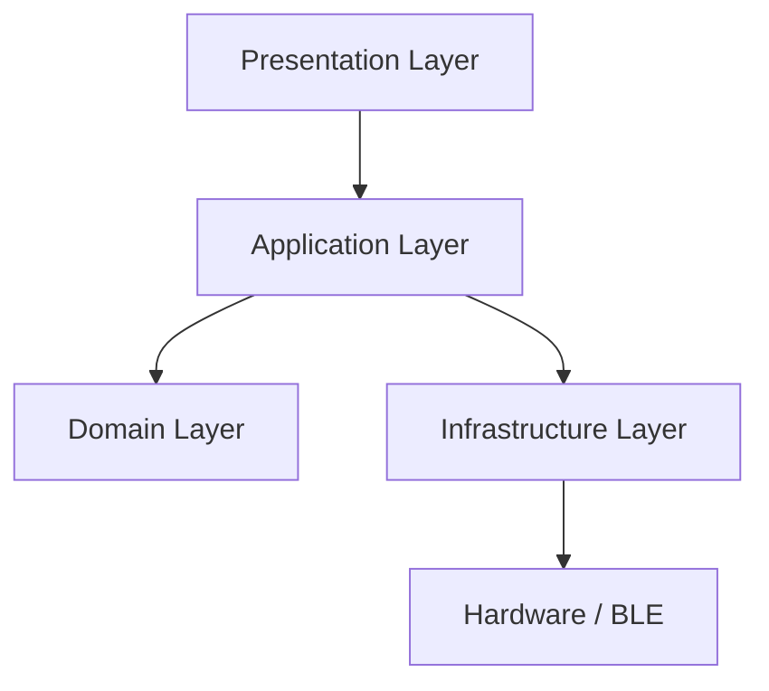

# DriveLytix


> **The Professional Telemetry & Diagnostics Platform for Modern Vehicles.**

**DriveLytix** is not just another OBD scanner—it is a comprehensive, real-time telemetry system engineered for enthusiasts, mechanics, and fleet managers. Built on a robust layered architecture, it transforms raw vehicle data into actionable insights, providing a premium "black box" experience on your mobile device.

---

## 🚀 Why DriveLytix?

Traditional OBD apps often suffer from clunky interfaces, unreliable connections, and "black box" logic where you can't see how data is processed.

**DriveLytix is different.**

- **Real-Time First**: Built from the ground up for high-frequency data streaming (up to 20Hz) without lag.
- **Privacy Centric**: All data belongs to you. Stored locally, with future-ready cloud sync options.
- **Transparent Logic**: Open-source domain layers allow you to inspect exactly how your engine data is calculated.
- **Product Scale**: Designed not as a demo, but as a scalable product capable of handling complex vehicle protocols.

---

## ✨ Key Capabilities

### 🔌 Industrial-Grade Connectivity

- **Universal Adapter Support**: Seamlessly connects to **ELM327** (BLE & Wi-Fi), **Vgate**, **OBDLink**, and more.
- **Smart Connection State Machine**: Auto-detects drops, attempts intelligent reconnection, and maintains protocol stability.
- **Protocol Agnostic**: Modular infrastructure layer that can accept plugins for proprietary protocols.

### 🏎️ Live Telemetry Dashboard

- **Lag-Free Gauges**: Visualize RPM, Speed, Load, and Temperatures with smooth 60fps animations.
- **Analysis Engine**: Real-time anomaly detection—get warned about **overheating** or **high engine load** instantly.
- **Dynamic Widgets**: Configure your dashboard. Engine nerds want **MAF & Fuel Trims**; daily drivers want **Economy & Range**.

### 🛠️ Professional Diagnostics (DTC)

- **Deep Scanning**: Access ECU memory for Active, Pending, and Permanent codes (Mode 03).
- **Clear & Reset**: Reset your Check Engine Light (MIL) directly from the app (Mode 04).
- **Contextual Help**: Don’t just see `P0300`—understand _why_ a misfire cylinder detected error occurred.

### 💾 Session Recording ("Black Box")

- **Flight Recorder**: Automatically record every drive session.
- **CSV Export**: Export logs for external analysis in Excel or professional tuning software.
- **History Tracking**: Compare vehicle health over time.

---

## 🏗️ Engineering Architecture

DriveLytix follows a **Strict Layered Architecture** to ensure maintenance, scalability, and testability.



- **Domain Layer**: Pure TypeScript business rules. Zero framework dependencies.
- **Application Layer**: Orchestrates data flow, manages `TelemetryService`, and handles analysis logic.
- **Infrastructure Layer**: Isolated I/O adapters. The BLE logic (`react-native-ble-plx`) is fully decoupled from the UI.
- **Presentation Layer**: React Native + Expo components that _observe_ data streams, ensuring the UI never blocks the communication thread.

---

## ⚡ Getting Started

### Prerequisites

- **Node.js** (LTS)
- **Expo Go** (for rapid testing) or **Android Studio/Xcode** (for production builds)
- A standard **OBD-II Bluetooth/BLE Adapter**.

### Installation

1. **Clone the Repository**

   ```bash
   git clone https://github.com/Start-Up-DriveLytix/DriveLytix.git
   cd DriveLytix
   ```

2. **Install Dependencies**

   ```bash
   npm install
   ```

3. **Ignition**

   ```bash
   npx expo start
   ```

4. **Connect**: Open the app, grant Bluetooth permissions, and it will automatically scan for compatible adapters.

---

## 🗺️ Roadmap

- [x] **Core Architecture**: Layered separation, Domain entities.
- [x] **BLE Stream**: Real-time OBD-II connectivity & PID decoding.
- [x] **Diagnostics**: DTC Reading & Clearing.
- [x] **Analysis API**: Basic anomaly detection engine.
- [ ] **Data Storage**: Local strict SQLite implementation for session logging.
- [ ] **Cloud Sync**: Optional redundant backup for fleet management.
- [ ] **AI Insights**: Predictive maintenance based on long-term fuel trim analysis.

---

## 🔭 Vision

We believe vehicle data should be **open, accessible, and beautiful**.
DriveLytix aims to bridge the gap between expensive professional scanners ($1000+) and cheap, ugly mobile apps. Our goal is to build the operating system for the connected car enthusiast—one that respects your data and empowers your drive.

---

## 🤝 Contributing

We welcome engineers, designers, and automotive experts.

1. **Fork** the repository.
2. **Create a Feature Branch** (`git checkout -b feature/AmazingFeature`).
3. **Commit** your changes.
4. **Push** to the branch.
5. **Open a Pull Request**.

---

_Engineered with 🔧 & 🏎️ by the DriveLytix Team._
